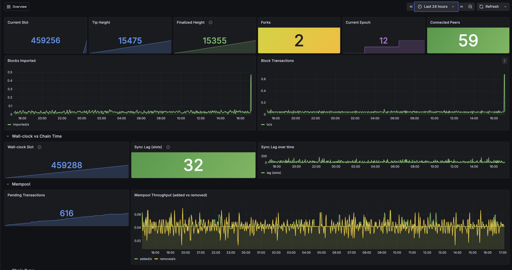
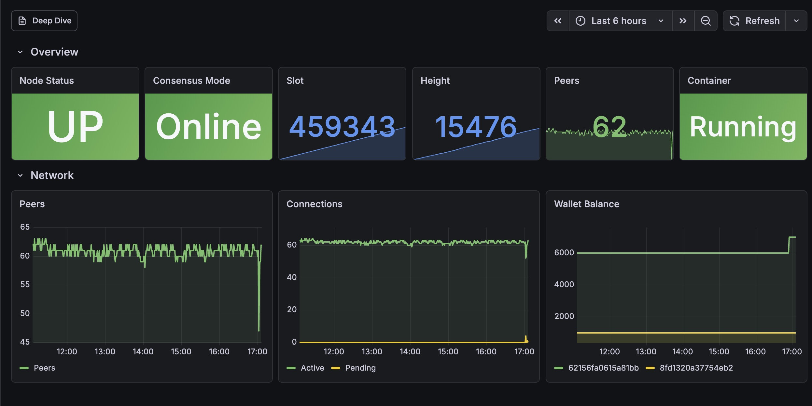

# Monitoring

Run a Grafana dashboard with Prometheus metrics for your node:

```sh
logosup monitor start     # Start Grafana + Prometheus + metrics exporter
logosup monitor status    # Show status and Grafana URL
logosup monitor stop      # Stop monitoring (node keeps running)
logosup monitor auth on   # Require login for Grafana
```

Grafana is available at `https://localhost:3001` (or your server's IP on port 3001). A self-signed SSL certificate is generated automatically on first run (valid for 10 years) and stored at:

```
~/.logos-node/monitoring/certs/
├── grafana.crt    # Self-signed certificate
└── grafana.key    # Private key
```

Your browser will show a security warning on first visit — accept it to proceed. To regenerate the certificate, delete the files above and restart monitoring.

## Dashboards

Two are provisioned:

- **Logos Node** (Overview) — at-a-glance status: consensus mode, slot/height, peers, container health, wallet balances.

  

- **Logos Node — Deep Dive** — native node metrics organized by service: consensus (block apply latency, proposals, fork count, finalized height), mempool (pending/added/removed), chainsync (request latency, downloads), orphans, blend (peers, message rates), KMS (sign requests/successes/failures), SDP (declarations, withdrawals), HTTP API and storage latency.

  

Use the "Deep Dive" link in the top-right of the Overview dashboard to switch between them. No login required by default — enable with `logosup monitor auth on`.

## Architecture

The monitoring stack runs as separate Docker containers alongside the node:

```
logosup ──OTLP/4317──▶ logos-otel ──:8889──▶ logos-prometheus ──▶ logos-grafana
                                                       ▲
logos-exporter (Python: container/host stats, wallet balances) ─────┘
```

- **logos-otel** (OpenTelemetry Collector) receives native metrics the node pushes via OTLP and re-exposes them in Prometheus format.
- **logos-exporter** (Python) covers what the node doesn't emit natively: container CPU/memory/network, host stats, wallet balances.
- **logos-prometheus** scrapes both, **logos-grafana** visualizes.

Native OTLP push is enabled automatically in `user_config.yaml` (`tracing.metrics: !Otlp`) by `logosup install` / `logosup reset`. If you've customized that field, your value is preserved.

All four containers share the `logosnode-net` Docker bridge network with the node.

## Troubleshooting: memory shows 0 B on Raspberry Pi

If the System & Containers dashboard shows **Memory: 0 B** and `docker stats` reports `0B / 0B` for MEM USAGE, the kernel doesn't have memory cgroups enabled. Pi OS doesn't enable them by default.

Fix on the Pi:

```sh
sudo nano /boot/firmware/cmdline.txt    # or /boot/cmdline.txt on older Pi OS
# Append (on the same single line):  cgroup_enable=memory cgroup_memory=1
sudo reboot
```

After reboot, `docker stats` should show real memory usage and the dashboard panels populate. Affects only memory; CPU and network metrics work without this flag.
